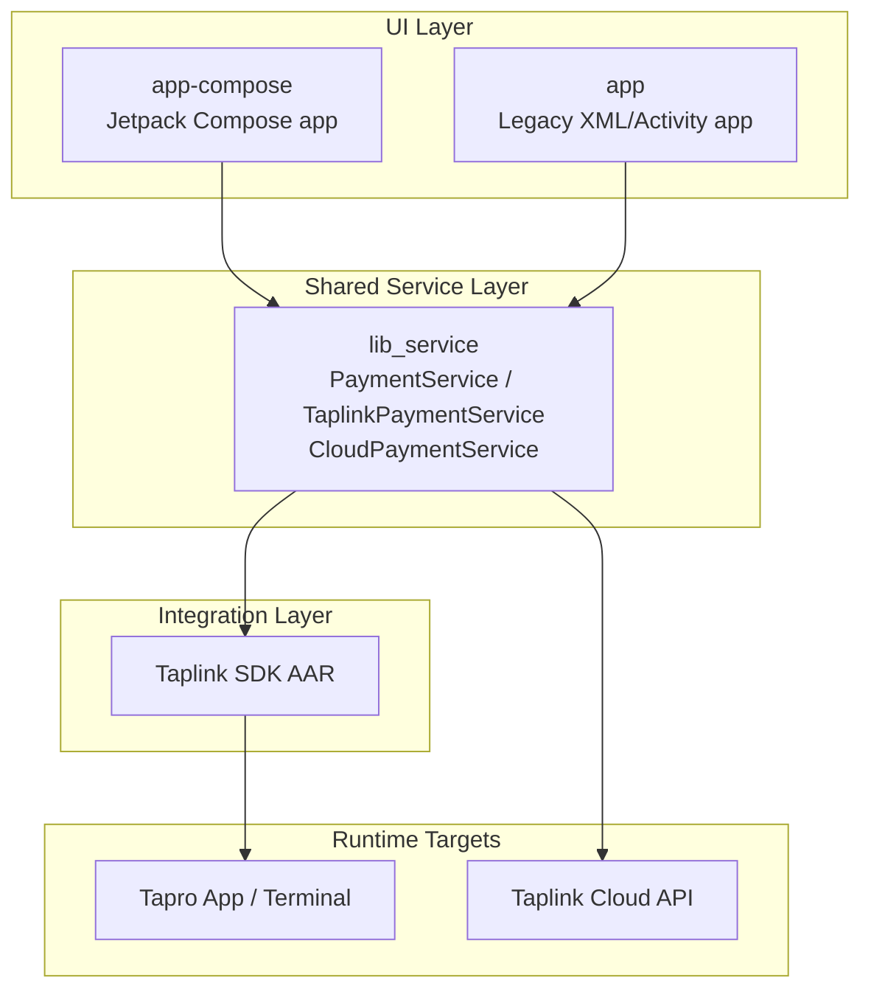
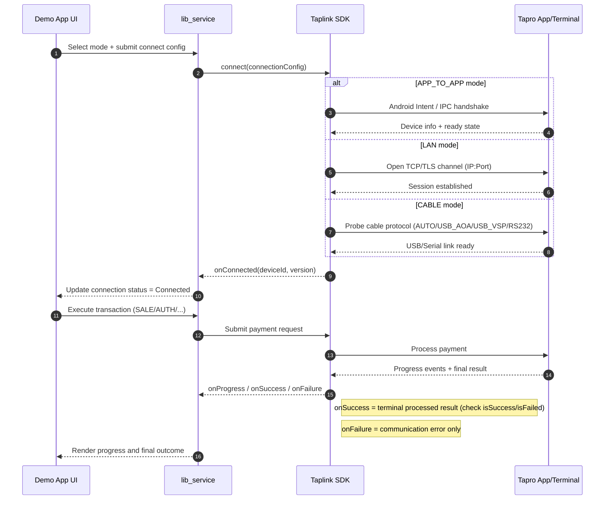

# Taplink SDK Android Demo

Android demo project for integrating SUNBAY Taplink payment capabilities in POS apps.  
This repository includes both a modern Jetpack Compose demo app and a legacy XML/Activity demo app, sharing one payment service module.

[](https://developer.android.com)
[](https://kotlinlang.org)
[](https://developer.android.com/about/versions/android-7.1)

## Overview

This project demonstrates how to:

- Initialize Taplink SDK with merchant credentials
- Connect to Tapro through multiple connection modes
- Execute common payment transactions end-to-end
- Query and manage transaction lifecycle states
- Build a POS-style UI with reusable payment logic

## Modules

- `app-compose`: Main demo app (Jetpack Compose + Material 3)
- `app`: Legacy demo app (XML layouts + Activity-based UI)
- `lib_service`: Shared payment abstraction and Taplink SDK integration

The root `settings.gradle.kts` includes all three modules.

## Key Features

- Connection modes:
  - `APP_TO_APP`
  - `CABLE` (AUTO / USB_AOA / USB_VSP / RS232 via SDK path)
  - `LAN`
  - `CLOUD` (supported in service/config flow)
- Transaction APIs:
  - SALE
  - AUTH
  - FORCED_AUTH
  - REFUND
  - VOID
  - POST_AUTH
  - INCREMENTAL_AUTH
  - TIP_ADJUST
  - QUERY (by request ID and by transaction ID)
  - BATCH_CLOSE
  - ABORT
- Order and transaction management:
  - Transaction history and detail pages
  - Progress callbacks and status handling
  - Retry/error handling helpers
- UI capabilities (Compose app):
  - Product grid + order summary flow
  - Additional amounts support (tip/tax/cashback/service fee)
  - Settings and connection configuration screens

## Tech Stack

- Kotlin `2.2.21`
- Android Gradle Plugin `8.13.1`
- Compile SDK `35`
- Min SDK `25`
- Java / JVM target `11`
- Jetpack Compose (in `app-compose`)
- Material Components / AndroidX

## Prerequisites

- Android Studio (recent version with AGP 8.x support)
- JDK 11+
- Android SDK 35
- A compatible SUNBAY Taplink environment (Tapro app / terminal, merchant credentials)

## Quick Start

### 1) Clone and open

```bash
git clone https://github.com/sunbay-developer/sunbay-taplink-sdk-android-demo.git
cd taplink-sdk-android-demo
```

Open the project in Android Studio and wait for Gradle sync.

### 2) Configure local SDK path

Ensure `local.properties` contains:

```properties
sdk.dir=/path/to/Android/sdk
```

### 3) Configure Taplink credentials

Use a single local secrets file for all sensitive parameters:

1. Copy template:

```properties
copy local.secrets.properties.example local.secrets.properties
```

2. Fill values in `local.secrets.properties`.
3. Do not commit this file (already ignored by `.gitignore`).

For external users, treat credentials as one unified parameter set:

- `TAPLINK_APP_ID`
- `TAPLINK_MERCHANT_ID`
- `TAPLINK_SECRET_KEY`
- `TAPLINK_CLOUD_BASE_URL`
- `TAPLINK_CLOUD_API_KEY`
- `TAPLINK_CLOUD_APP_ID`
- `TAPLINK_WEBHOOK_KEY` (if enabled in your integration)

Template file:

- `local.secrets.properties.example`

For real parameters, contact SUNBAY/Taplink support and request credential issuance for your merchant account.

> Note: the current demo implementation keeps internal UAT/PROD key groups to support our testing workflow.  
> You do not need to manage environment splitting manually; just fill the template values as instructed.

Non-sensitive static config is still kept in:

- `app-compose/src/main/res/values/config.xml` (Compose app)
- `app/src/main/res/values/config.xml` (legacy app)

At minimum, verify:

- `taplink_app_id`
- `taplink_merchant_id`
- `taplink_secret_key`
- default connection mode and network/cloud settings as needed

> Security note: Do not commit production secrets to source control.

### 4) Build and install

Build all modules:

```bash
./gradlew build
```

Install Compose debug app:

```bash
./gradlew :app-compose:installDebug
```

Install legacy debug app:

```bash
./gradlew :app:installDebug
```

## Running the Demo

1. Install and prepare Tapro / payment terminal environment.
2. Launch either app:
   - Compose: package `com.sunmi.taplink.demo`
   - Legacy: package `com.sunmi.tapro.taplink.demo`
3. Configure connection mode in app settings.
4. Create an order and start a transaction.
5. Check progress and final transaction records.

## Project Structure

```text
taplink-sdk-android-demo/
├── app/                  # Legacy XML + Activity demo app
├── app-compose/          # Main Compose demo app
├── lib_service/          # Shared payment/service integration module
├── doc/                  # Test knowledge base and templates
├── sunbay-taplink-sdk-android-1.0.3-release.aar
├── build.gradle.kts
├── settings.gradle.kts
└── README.md
```

## Architecture Diagram



## Unified Connection Sequence



## Service Layer Notes

`lib_service` provides:

- `PaymentService` interface for app-level decoupling
- `TaplinkPaymentService` for SDK-backed local mode operations
- Cloud-related classes:
  - `CloudHttpClient`
  - `CloudPaymentService`
  - `CloudResponseMapper`
- Shared models and status helpers (`PaymentResult`, amount/card/batch metadata)

This design allows both UI apps to reuse the same payment workflow logic.

## Error Handling

When `result.isFailed()`, inspect `result.code` and `result.message` for detailed error analysis:

```kotlin
override fun onSuccess(result: PaymentResult) {
    when {
        result.isSuccess() -> handleSuccess(result)
        result.isFailed() -> {
            // result.code    → SDK standard error code (e.g. "307", "310")
            // result.message → Detailed error from Tapro (e.g. "K004: Insufficient funds (051)")
            Log.e(TAG, "Failed: code=${result.code}, message=${result.message}")
        }
    }
}
```

> `onFailure` is only called for communication/technical errors (connection lost, send failed, etc.), not for transaction declines.

## Troubleshooting

- Gradle sync fails:
  - Check JDK is 11+
  - Confirm Android SDK path in `local.properties`
- Connection errors:
  - Verify selected mode and corresponding environment (same device / cable / LAN / cloud endpoint)
  - Confirm Tapro availability and credential correctness
- Transaction remains processing:
  - Use query APIs to poll status before retrying
  - Avoid duplicate request IDs unless retry rules allow it

## License

Commercial software.  
Copyright © SUNMI / SUNBAY.

